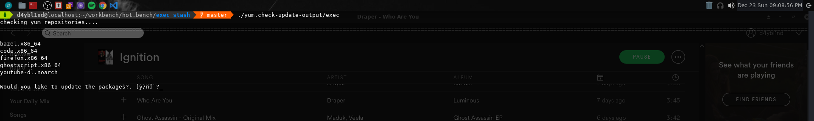
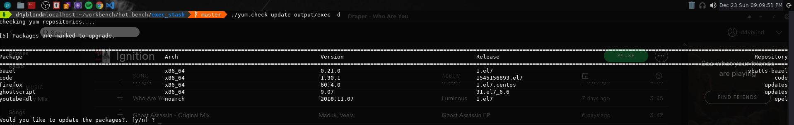
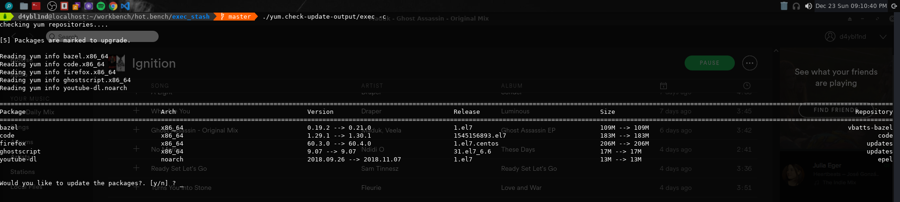

some outputs are overly simplifed in  way but i will add more in time. 
I always wanted something like this so here it is. 
It might need more features to make it actaully useful i think. 

## Options

 __-d__     Detailed

 __-c__     Compare

Screenshot

 

 

